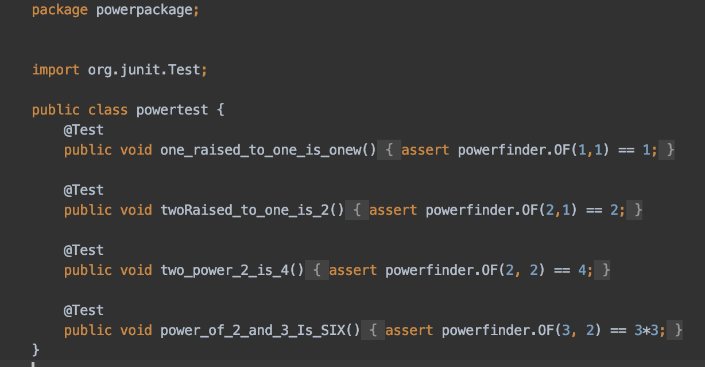

- Alright. Akshay has recently started to learn Java and its associated unit testing library JUnit. 
- to practice he wrote some code to find the `x^y` without using any library functions (like `Math.pow`) and he also wrote some of its associated unit test. 
- but he was also in a rush and didn't care about clean code or basic java conventions. Now he is not sure why Intellij (or gradle for that matter) won't run his test. Also his code looks ugly. Can you help him fix these problems. 
    - 
- ensure you fix the issue due to which tests are not running, secondly take care of basic java naming conventions, third look for anything inconsistent or typo and anything else you think can be improved.

# ---------------------------------------------------------------
# Java Naming Conventions

## Class Names
- **Convention:** PascalCase (e.g., `PowerFinder`).
- **Definition:** Names of classes should start with an uppercase letter and use camel case for each subsequent word.

## Method Names
- **Convention:** camelCase (e.g., `calculatePower`).
- **Definition:** Method names should start with a lowercase letter and use camel case for each subsequent word.

## Variable Names
- **Convention:** camelCase (e.g., `baseValue`).
- **Definition:** Variable names should start with a lowercase letter and use camel case for each subsequent word.

# ---------------------------------------------------------------

# Changes in code

## Package Structure
1. Changed package **_main/java/powerpackage_** to _**main/java/com/example/math/operations**_
2. Changed package **_test** to _**test/java/com/example/math/operations**_

## Calculate power class

1. Added elementary comment in method
2. _**powerfinder**_ class name changed to _**PowerFinder**_
2. _**0F**_ method name changed to _**calculatePower**_
3. Parameter 1 **_xyz_** changed to base
4. Parameter 1 _**pqr**_ changed to _**exponent**_
5. Variable name _**p**_ changed to _**result**_

## Test class

1. Changed class name _**powertest**_ to _**PowerFinderTest**_
2. Changed method name _**one_raised_to_one_is_onew**_ to _**testOneRaisedToOneIsOne**_
3. Changed method name _**twoRaised_to_one_is_2**_ to _**testTwoRaisedToOneIsTwo**_
4. Changed method name _**two_power_2_is_4**_ to _**testTwoPowerTwoIsFour**_
5. Changed method name _**power_of_2_and_3_Is_SIX**_ to _**testThreePowerTwoIsNine**_
6. Added failed message in assertEquals.

## build.gradle

Updated gradle file 

### Old build.gradle
```groovy
plugins {
    id 'java'
}

group 'org.example'
version '1.0-SNAPSHOT'

sourceCompatibility = 1.8

repositories {
    mavenCentral()
}

dependencies {
    testCompile group: 'junit', name: 'junit', version: '4.12'
}
```


### New build.gradle
```groovy
plugins {
    id 'java'
}

repositories {
    mavenCentral()
}

dependencies {
    testImplementation 'org.junit.jupiter:junit-jupiter-api:5.8.1'
    testRuntimeOnly 'org.junit.jupiter:junit-jupiter-engine:5.8.1'
}

test {
    useJUnitPlatform()
}
```
